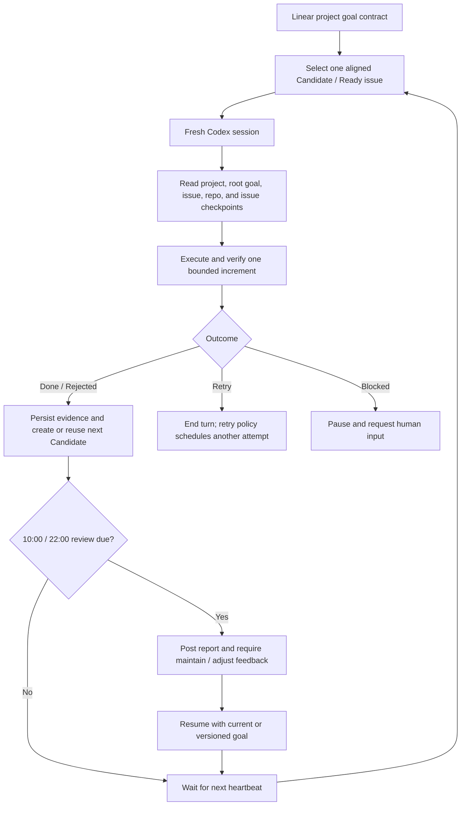

# Loophony

Loophony is a small, Linear-driven 24/7 agent orchestrator built on
[OpenAI Symphony](https://github.com/openai/symphony). You define one durable objective on a
Linear project, and Loophony repeatedly gives Codex one bounded Linear issue at a time. Linear is
the human-facing control plane; local SQLite, repository artifacts, and git history preserve the
execution trail between fresh Codex sessions.

> [!WARNING]
> Loophony is an experimental preview for trusted local environments. It never enables live
> trading, spending, or secret entry through prompts.

## Operating contract

- One Loophony loop equals one Linear issue and one fresh Codex execution session.
- A heartbeat checks for work every 20 minutes, but never starts another loop while one is running.
- The pending queue is bounded to five issues.
- Issues with verified evidence may move directly to `Done`; they do not accumulate in human
  review.
- Only a real `Blocked` condition and the scheduled 10:00/22:00 KST goal-review gate require human
  input.
- The project description holds the big objective, the `[Goal]` issue holds measurable success
  criteria, and `[Agent Goal Review]` holds human maintain/adjust decisions.

## Set up from Codex App

Codex can perform the installation for you. The only manual boundaries are connector OAuth, local
Keychain secret entry, and starting a new Codex task after new plugins are installed.

Prepare these non-secret values:

- an existing Linear project URL or unambiguous project name;
- your Linear reviewer handle;
- the git clone URL of the repository where Loophony should do its work.

Do not paste a Linear API token, brokerage secret, or other credential into Codex or Linear.

### 1. Bootstrap Loophony

Open a new task in Codex App and paste this prompt:

```text
이 Mac에 공개 저장소 https://github.com/djm07073/loophony 의 Loophony를 설치해줘.

1. 저장소의 skills/loophony-setup 스킬을 내 Codex 사용자 스킬 디렉터리에 설치해.
2. 설치한 SKILL.md를 직접 읽고 같은 작업에서 그 절차를 계속 수행해.
3. 저장소를 ~/dev/agents/loophony에 안전하게 클론하거나 기존의 깨끗한 클론을 재사용해.
4. 사전 점검을 실행하고 Loophony, Linear, Alpaca 플러그인을 설치해.
5. Linear와 Alpaca OAuth가 필요하면 내가 Codex App에서 연결할 수 있도록 정확한 시점에 멈춰서 알려줘.
6. Elixir 데몬을 빌드하고 상태를 검증하되, 아직 서비스는 시작하지 마.
7. 토큰이나 비밀값을 채팅으로 요청하거나 출력하지 마.

새 플러그인을 사용하려면 새 Codex 작업이 필요할 경우, 다음에 붙여넣을 목표 생성 프롬프트까지 알려줘.
```

Connect Linear in Codex App when prompted. Alpaca is optional unless the project needs its
read-only market-data tools. Start a new Codex task after the plugins are installed.

### 2. Create the durable project goal

In the new task, replace the placeholders and paste:

```text
$loophony-create-goal

다음 Linear 프로젝트에 Loophony 대목표를 만들어줘.

- 프로젝트: <LINEAR_PROJECT_URL_OR_EXACT_NAME>
- 내가 원하는 변화: <BROAD_OBJECTIVE>
- 중요하게 생각하는 제약: <CONSTRAINTS_OR_UNKNOWN>

프로젝트와 기존 이슈를 먼저 읽고, 확인할 수 있는 사실은 직접 조사해.
목표·범위·트레이드오프처럼 내가 결정해야 하는 내용만 한 번에 하나씩 질문해.
실행량이 아니라 관찰 가능한 결과, 성공 기준, 증거 출처, 비목표, 권한 경계,
달성·기각·재조정 조건으로 목표 계약을 작성해.

쓰기 전에 초안과 품질 게이트 결과를 보여주고 내 승인을 받아.
승인 후 프로젝트 설명의 Loophony Goal 블록, [Goal] 루트 이슈,
[Agent Goal Review] 이슈를 중복 없이 생성하거나 갱신해.
아직 실행용 Candidate 이슈는 만들지 마.
```

The skill returns the project slug, root goal issue, and persistent review issue identifier. Keep
those values for the final setup prompt.

### 3. Seed the first loop

Goal provisioning deliberately does not invent an execution backlog. After approving the goal,
paste this follow-up in the same task to create only the first bounded issue:

```text
방금 확정한 Loophony 대목표에서 지금 가장 높은 레버리지를 가진 첫 번째 실행 이슈를 만들어줘.

Linear 프로젝트와 [Goal] 루트 이슈를 다시 읽고 아직 충족되지 않은 성공 기준 하나를 선택해.
정확히 하나의 child issue만 만들고 다음 조건을 지켜:

- 상태: Candidate
- 라벨: symphony-quant
- 하나 이상의 SC-* 성공 기준에 명시적으로 매핑
- 하나의 Codex 세션에서 독립적으로 검증 가능한 범위
- 실행 전에 확인 가능한 acceptance checks와 필요한 evidence 기재
- 프로젝트 제약, 비목표, 권한 경계를 그대로 상속
- 이미 완료됐거나 기각된 작업과 중복 금지

목표가 이미 완전히 증명됐거나 안전하게 실행할 다음 단계가 없으면 이슈를 만들지 말고 이유를 알려줘.
생성 후 이슈 identifier, URL, 매핑된 성공 기준을 보여줘.
```

This is the only issue that normally needs manual seeding. Before a worker finishes, it creates or
reuses exactly one suitable next `Candidate` unless the root goal is fully proven or the current
issue is `Blocked`.

### 4. Configure and start the daemon

Open a new task, replace the placeholders with the values returned above, and paste:

```text
$loophony-setup

Loophony 설치를 이어서 구성하고 24/7 서비스를 시작해줘.

- Linear 프로젝트 slug: <PROJECT_SLUG>
- 목표 검토 이슈: <TEAM-123>
- 리뷰어: <@HANDLE>
- 작업 저장소 clone URL: <GIT_CLONE_URL>

설정을 렌더링하고 빌드와 health check를 실행해.
Linear API 토큰이 필요하면 토큰을 받지 말고 내가 로컬 터미널에서 Keychain에 직접
입력할 수 있는 명령만 알려줘. 기존 Candidate/Ready 이슈가 즉시 실행될 수 있음을 먼저 알려주고,
내가 시작하라고 확인하면 launchd 서비스를 설치해. 마지막에는 데몬 상태와 다음 heartbeat,
현재 실행·대기·Blocked·review gate 상태를 보여줘.
```

After health succeeds, use `$loophony-control` in Codex App to inspect or steer the daemon.

## Example: a quant research goal

Assume the Linear project is `Quant Research Lab` and the initial request is vague:

> Continuously research US equity signals and find profitable strategies.

That is an activity, not a finishable goal. `$loophony-create-goal` asks about the baseline,
decision the system must enable, universe, evidence standard, authority, and stopping conditions.
For example, the short shaping dialogue might be:

```text
Codex: What is the current baseline that should change?
User: Data and notebooks exist, but results cannot be reproduced by a fresh session.

Codex: What decision must the finished system make reliably?
User: It must accept or reject a signal hypothesis under predefined out-of-sample and cost gates.

Codex: What authority is explicitly outside the system?
User: No live orders or spending. Read-only and paper data only.
```

The resulting contract could look like this:

```markdown
Outcome: Build a reproducible US-equity research system that can accept or reject signal
hypotheses using predeclared out-of-sample, cost, liquidity, and capacity gates without live
trading.

SC-01 — A point-in-time dataset can be rebuilt from an immutable snapshot
        | deterministic hash and data-quality checks pass
        | dataset manifest and CI report

SC-02 — The backtest harness detects injected look-ahead and survivorship leakage
        | all adversarial leakage fixtures fail closed
        | test report and committed fixtures

SC-03 — Every evaluated hypothesis produces a reproducible accept or reject decision
        | walk-forward result includes fees, spread, slippage, turnover and capacity assumptions
        | versioned research package linked from Linear

Non-goals: live orders, guaranteed returns, unrestricted universe expansion.
Authority: read-only or paper data only; credentials never enter Linear or prompts.
Achieved: all three contracts have repeatable evidence and can be operated by a fresh session.
Reframe: required data is unavailable or the evidence gates cannot answer the intended decision.
```

Loophony then turns the contract into bounded work, one issue at a time:

1. Codex App seeds `QRL-101 — Build immutable point-in-time dataset manifest`, mapped to `SC-01`.
2. One Codex session executes only `QRL-101`, records checkpoints in SQLite, updates one Linear
   workpad, commits reproducible artifacts, creates or reuses `QRL-102 — Add adversarial leakage
   fixtures`, and moves `QRL-101` to `Done` when evidence passes.
3. Completion triggers an immediate poll. Because no loop is running, Loophony selects `QRL-102`
   without waiting for the next 20-minute timer.
4. A later fresh session evaluates a signal hypothesis for `SC-03`. A correctly reproduced
   negative result may finish that issue as `Rejected`; it is not treated as an agent failure.
5. At 10:00 or 22:00 KST, Loophony posts a consolidated report to `[Agent Goal Review]` and pauses.
   The user responds `maintain` with feedback, or `adjust` with a revised direction. An adjustment
   creates a new goal version and future issues are realigned to it.



## How a fresh session recovers context

A new loop does not depend on hidden chat memory. It reconstructs its context from:

- the Linear project description and root `[Goal]` success criteria;
- the current issue description, relations, acceptance checks, workpad, and human comments;
- repository files, git history, tests, datasets, and published artifacts;
- only the current issue's recent SQLite checkpoints.

Cross-issue knowledge must be handed off explicitly through the next issue and linked artifacts.
The agent re-checks every candidate issue against the active goal before running it; misaligned work
is narrowed or rejected instead of silently consuming another loop.

## Manual installation

To install only the standalone bootstrap skill:

```sh
python3 ~/.codex/skills/.system/skill-installer/scripts/install-skill-from-github.py \
  --repo djm07073/loophony \
  --path skills/loophony-setup
```

To install only the public plugin:

```sh
/Applications/Codex.app/Contents/Resources/codex plugin marketplace add djm07073/loophony
/Applications/Codex.app/Contents/Resources/codex plugin add loophony@loophony-public
```

## Upstream Symphony

The original Symphony design turns project work into isolated agent runs. This fork keeps the
official Elixir orchestrator as its base and adds the Linear goal contract, issue-scoped SQLite
loop memory, queue and heartbeat rules, scheduled human goal review, and the Loophony Codex plugin.

For the upstream specification and reference implementation, see:

- [Symphony specification](https://github.com/openai/symphony/blob/main/SPEC.md)
- [Elixir runtime documentation](elixir/README.md)
- [Loophony quant profile](quant/README.md)

## License

This project is licensed under the [Apache License 2.0](LICENSE).
