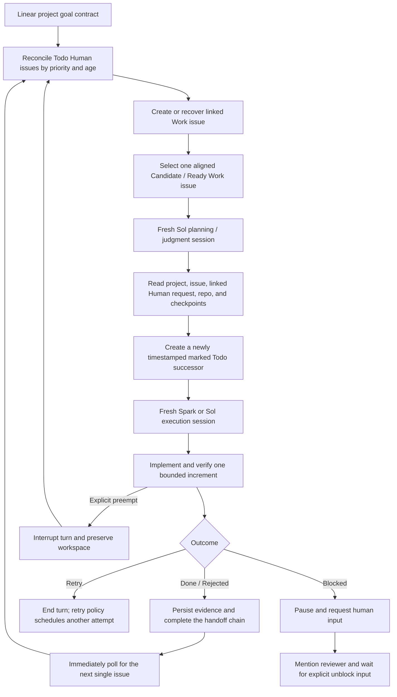

# Loophony

Loophony is a small, Linear-driven 24/7 agent orchestrator built on
[OpenAI Symphony](https://github.com/openai/symphony). You define one durable objective on a
Linear project, and Loophony repeatedly gives Codex one bounded Linear issue at a time. Linear is
the human-facing control plane; local SQLite preserves issue checkpoints, while optional Onyx v4
and OpenSearch 3.6 hybrid search let Codex answer natural-language questions across sessions.

> [!WARNING]
> Loophony is an experimental preview for trusted local environments. It never enables live
> trading, spending, or secret entry through prompts.

## Operating contract

- One Loophony loop equals one Linear issue and one fresh Codex execution session.
- A completed loop immediately hands off to the next eligible issue; the 30-second idle heartbeat
  only discovers externally created work and reconciles missed state changes.
- Exactly one top-level Codex worker session and one internal pending dispatch slot are allowed
  globally. Linear may contain multiple aligned `Todo` issues, but only one executable issue may
  be `In Progress`.
- Unmarked issues start as `gpt-5.6-sol` planning and judgment sessions. When implementation is
  required, that session creates a new linked Todo successor during the current session containing a durable
  `loophony-handoff:v1` marker and a complete execution packet. The successor starts in a fresh
  top-level session on either `gpt-5.3-codex-spark` for bounded coding/tests or `gpt-5.6-sol` when
  complex judgment remains. The source session never executes its successor.
- Session-boundary invariants fail closed: an execution issue must have exactly one marker, a
  different terminal source issue, and an allowed model. A source issue cannot finish unless a
  distinct marked Todo successor created after the source session began is re-read from Linear and
  named by the terminal checkpoint, or the checkpoint contains an explicit root-goal termination
  reason. Existing Todo issues cannot be repurposed as successors.
- Issues with verified evidence may move directly to `Done`; they do not accumulate in human
  review.
- A valid negative result is also `Done` with a durable `rejected` evidence outcome. Workers never
  choose `Canceled`, `Cancelled`, or `Duplicate`; those states are reserved for humans or external
  systems.
- Only a real `Blocked` condition requires human input during ordinary autonomous research and it
  posts a Linear comment that mentions the configured reviewer. Scheduled review is optional per
  profile, and live trading remains separately authorized.
- The project description holds the big objective, the `[Goal]` issue holds measurable success
  criteria, and `[Agent Goal Review]` holds human maintain/adjust decisions.
- Every accepted operator-feedback message becomes a durable `[Human]` issue in `Todo`. Loophony
  selects Human issues by Linear priority and creation time, creates a linked `[Work]` issue, and
  dispatches only the Work issue. The machine markers make this idempotent across daemon restarts.
  Explicit preemption returns the interrupted source issue to Todo, defaults the new request to
  Urgent when no priority is supplied, and preserves the source workspace for later resumption.
- While work is running, Loophony appends immutable Linear checkpoint comments and periodic health
  comments. Every record includes UTC and KST timestamps; existing progress comments are never
  edited or deleted.
- Long external waits are represented as durable `Waiting` records instead of sleeping inside a
  Codex turn. Long-running local commands can be launched as supervised jobs whose status, log,
  exit marker, and resume context survive daemon restarts.
- A separate append-only SQLite audit ledger records operator, scheduler, checkpoint, wait, job,
  budget, goal-review, and memory-health transitions. Each event is secret-redacted and linked to
  the previous event with a versioned canonical SHA-256 format so offline edits are detectable.
- Configurable issue/day token and active-runtime budgets warn before and after exhaustion without
  stopping work by default; explicit `block` and daily-reset `wait` policies remain available. The
  goal policy rejects ambiguous executable queues,
  missing goal versions, and work that does not map to the single active stage.

## Set up from Codex App

Codex can perform the installation for you. The only manual boundaries are connector OAuth, local
Keychain secret entry, and starting a new Codex task after new plugins are installed.

Prepare these non-secret values:

- an existing Linear project URL or unambiguous project name;
- your Linear reviewer handle;
- the git clone URL of the repository where Loophony should do its work.

Do not paste a Linear API token, brokerage secret, or other credential into Codex or Linear.

### 1. Bootstrap Loophony

Open a new task in Codex App and paste this prompt:

```text
Install Loophony on this Mac from the public repository
https://github.com/djm07073/loophony.

1. Install the repository's skills/loophony-setup skill in my Codex user skills directory.
2. Read the installed SKILL.md and continue following it in this task.
3. Safely clone the repository to ~/dev/agents/loophony, or reuse a clean matching clone.
4. Run preflight checks and install the Loophony, Linear, and Alpaca plugins.
5. If Linear or Alpaca OAuth is required, stop at the correct point and tell me how to connect it
   in Codex App.
6. Build and verify the Elixir daemon, but do not start the service yet.
7. Never request or print tokens or secrets in chat.

If a new Codex task is required to load the new plugins, give me the exact goal-creation prompt to
paste into that task.
```

Connect Linear in Codex App when prompted. Alpaca is optional unless the project needs its
read-only market-data tools. Start a new Codex task after the plugins are installed.

### 2. Create the durable project goal

In the new task, replace the placeholders and paste:

```text
$loophony-create-goal

Create the durable Loophony goal for this Linear project.

- Project: <LINEAR_PROJECT_URL_OR_EXACT_NAME>
- Desired change: <BROAD_OBJECTIVE>
- Important constraints: <CONSTRAINTS_OR_UNKNOWN>

Read the project and existing issues first. Research facts that you can verify independently.
Ask one question at a time only for decisions I must make, such as goals, scope, and tradeoffs.
Define the goal contract using observable outcomes, success criteria, evidence sources, non-goals,
authority boundaries, and conditions for achievement, rejection, or reframing—not activity volume.

Before writing, show me the draft and quality-gate result and obtain my approval.
After approval, create or update the project description's Loophony Goal block, the [Goal] root
issue, and the [Agent Goal Review] issue without creating duplicates.
Do not create an executable Candidate issue yet.
```

The skill returns the project slug, root goal issue, and persistent review issue identifier. Keep
those values for the final setup prompt.

### 3. Seed the first loop

Goal provisioning deliberately does not invent an execution backlog. After approving the goal,
paste this follow-up in the same task to create only the first bounded issue:

```text
Create the highest-leverage first executable issue for the Loophony goal we just approved.

Re-read the Linear project and [Goal] root issue, then select one unmet success criterion.
Create exactly one child issue with these requirements:

- State: Candidate
- Label: symphony-quant
- Assignee: me
- Explicitly map it to at least one SC-* success criterion
- Keep it independently verifiable within one Codex session
- Include acceptance checks and required evidence before execution
- Inherit the project's constraints, non-goals, and authority boundaries
- Do not duplicate completed or rejected work

If the goal is already fully proven or no safe next increment exists, do not create an issue;
explain why. After creation, show the issue identifier, URL, and mapped success criterion.
```

This is the only issue that normally needs manual seeding. Before a worker finishes, it creates
exactly one new suitable next `Candidate` during that session unless the root goal is fully proven
or the current issue is `Blocked`.

### 4. Configure and start the daemon

Open a new task, replace the placeholders with the values returned above, and paste:

```text
$loophony-setup

Continue configuring Loophony and start it as a 24/7 service.

- Linear project slug: <PROJECT_SLUG>
- Goal-review issue: <TEAM-123>
- Reviewer: <@HANDLE>
- Work repository clone URL: <GIT_CLONE_URL>

Render the configuration, build the daemon, and run its health check.
If a Linear API token is required, never accept it in chat. Give me only the command that lets me
enter it directly into Keychain from my local terminal. Warn me that existing Candidate or Ready
issues may run immediately. After I confirm that you should start, install the launchd service.
Finally, show the daemon status, next heartbeat, and current running, queued, Blocked, and review
gate states.
```

After health succeeds, use `$loophony-control` in Codex App to inspect or steer the daemon.

## Ask Codex about prior loops

Loophony keeps retrieval and answer generation separate. Loophony normalizes documents and creates
contextual, paragraph-aware sections; Onyx v4 owns ingestion, embeddings, and OpenSearch 3.6
keyword/vector hybrid retrieval. Its local model servers use
`intfloat/multilingual-e5-base` (768 dimensions), so Korean questions search Korean and English
evidence directly without translating or storing an English-only copy. Query expansion and Onyx
LLM document selection stay disabled: Codex uses the `loophony-query` skill and Loophony's
read-only MCP tools to synthesize the final evidence-backed answer.

The index contains seven provenance-preserving document types: the canonical `linear_project`
objective, current `linear_issue` snapshots, derived `session_summary` rollups, raw `checkpoint`
records, final agent messages, errors, and session lifecycle events. The project objective is
stored once under a stable project ID instead of being repeated in every issue chunk. Project and
issue snapshots are updated after tracker reads; unchanged content is not re-embedded again during
the same daemon runtime. Session summaries are generated deterministically at turn completion from
that session's checkpoints and recent final messages. They help navigation but do not replace the
raw records used to verify claims.

### RAG document-processing policy

- Preserve raw evidence and create summaries as separate derived documents. Do not make a lossy
  summary the only searchable record.
- Use stable source IDs, schema versions, update timestamps, and content hashes so changed records
  upsert predictably and unchanged records can be skipped.
- Chunk on paragraph boundaries (up to 1,200 characters here), let Onyx enforce its token-aware
  limit, and prepend project, evidence type, issue, session, timestamp, and title context to every
  submitted section. The active E5 model truncates inputs beyond 512 tokens, so large character-only
  chunks are unsafe for multilingual text.
- Store filterable provenance separately from searchable text, then apply issue, session, type, and
  time filters before Codex writes an answer.
- Evaluate retrieval independently with a small set of real Korean and English progress, decision,
  failure, and chronology questions; measure whether the supporting evidence appears in the top
  results before evaluating answer prose.

## Silent-death protection

Loophony uses independent liveness layers rather than treating an `In Progress` Linear state as
proof that work is alive:

- The orchestrator polls every 30 seconds and measures silence from the latest Codex app-server
  event. The quant profile restarts a silent worker after 10 minutes while preserving its workspace.
- A running issue receives an append-only `## Loophony Health` comment every 15 minutes. It records
  the observation time, daemon boot ID, worker state, session, latest event time, silence duration,
  restart threshold, and next heartbeat in both UTC and KST.
- Semantic loop checkpoints are appended as separate `## Loophony Checkpoint` comments. Identical
  retries are deduplicated by a content fingerprint, while changed evidence remains visible as a
  new immutable revision.
- A detected silent stall appends a timestamped health event before the worker is restarted.
- Memory health uses a real hybrid-search canary, tracks search and ingestion separately, and opens
  a short circuit breaker after repeated failures instead of reporting a healthy socket as healthy
  retrieval.
- On macOS, the independent launchd watchdog probes the loopback API every 60 seconds and restarts
  the daemon only after two consecutive failures, so one transient timeout does not interrupt work.

These choices follow current guidance on cleaning, metadata, semantic chunking, incremental
updates, and retrieval evaluation from
[Microsoft's advanced RAG guide](https://learn.microsoft.com/en-us/azure/developer/ai/advanced-retrieval-augmented-generation),
the context-prepending and hybrid retrieval findings in
[Anthropic's Contextual Retrieval](https://www.anthropic.com/engineering/contextual-retrieval),
[Onyx's stable document/section model](https://docs.onyx.app/developers/core_concepts), and
[OpenSearch's rank evaluation API](https://docs.opensearch.org/latest/api-reference/search-apis/rank-eval/).
The model-specific limit comes from the
[`multilingual-e5-base` model card](https://huggingface.co/intfloat/multilingual-e5-base).

Start the local retrieval dependencies before enabling `memory` in the rendered workflow:

```sh
python3 elixir/scripts/onyx_bootstrap.py
```

Then ask in Codex App, for example, “지난 세션들이 인증 마이그레이션을 포기한 이유가 뭐야?”
The answer cites exact issue, session, and evidence identifiers. The Onyx administrator token is
stored in macOS Keychain and is available only to the Loophony daemon; the Codex plugin exposes a
smaller read-only search surface rather than direct administrative access.

## Example: a quant research goal

Assume the Linear project is `Quant Research Lab` and the initial request is vague:

> Continuously research US equity signals and find profitable strategies.

That is an activity, not a finishable goal. `$loophony-create-goal` asks about the baseline,
decision the system must enable, universe, evidence standard, authority, and stopping conditions.
For example, the short shaping dialogue might be:

```text
Codex: What is the current baseline that should change?
User: Data and notebooks exist, but results cannot be reproduced by a fresh session.

Codex: What decision must the finished system make reliably?
User: It must accept or reject a signal hypothesis under predefined out-of-sample and cost gates.

Codex: What authority is explicitly outside the system?
User: No live orders or spending. Read-only and paper data only.
```

The resulting contract could look like this:

```markdown
Outcome: Build a reproducible US-equity research system that can accept or reject signal
hypotheses using predeclared out-of-sample, cost, liquidity, and capacity gates without live
trading.

SC-01 — A point-in-time dataset can be rebuilt from an immutable snapshot
        | deterministic hash and data-quality checks pass
        | dataset manifest and CI report

SC-02 — The backtest harness detects injected look-ahead and survivorship leakage
        | all adversarial leakage fixtures fail closed
        | test report and committed fixtures

SC-03 — Every evaluated hypothesis produces a reproducible accept or reject decision
        | walk-forward result includes fees, spread, slippage, turnover and capacity assumptions
        | versioned research package linked from Linear

Non-goals: live orders, guaranteed returns, unrestricted universe expansion.
Authority: read-only or paper data only; credentials never enter Linear or prompts.
Achieved: all three contracts have repeatable evidence and can be operated by a fresh session.
Reframe: required data is unavailable or the evidence gates cannot answer the intended decision.
```

Loophony then turns the contract into bounded work, one issue at a time:

1. Codex App seeds `QRL-101 — Build immutable point-in-time dataset manifest`, mapped to `SC-01`.
2. One Codex session executes only `QRL-101`, records checkpoints in SQLite, keeps its bootstrap
   workpad immutable, appends timestamped Linear checkpoint comments, commits reproducible
   artifacts, creates or reuses `QRL-102 — Add adversarial leakage
   fixtures`, and moves `QRL-101` to `Done` when evidence passes.
3. Completion triggers an immediate poll. Because no loop is running, Loophony selects `QRL-102`
   without waiting for the idle heartbeat.
4. A later fresh session evaluates a signal hypothesis for `SC-03`. A correctly reproduced
   negative result may finish that issue as `Rejected`; it is not treated as an agent failure.
5. The user may inspect Linear at any time and submit feedback. Every accepted request becomes a
   `[Human]` Todo issue, so the user can see exactly which ticket Loophony will handle. Loophony
   claims the highest-priority oldest Human issue and creates a linked `[Work]` issue. Sol turns
   that request into a durable execution handoff when coding is required; the Human source remains
   Todo until the complete downstream handoff chain finishes. Ordinary feedback stays queued
   without disturbing active work. Only an explicit preemption interrupts the active Codex turn
   and preserves its workspace before scheduling resumes.



## How a fresh session recovers context

A new loop does not depend on hidden chat memory. It reconstructs its context from:

- the Linear project description and root `[Goal]` success criteria;
- the current issue description, relations, acceptance checks, workpad, and human comments;
- repository files, git history, tests, datasets, and published artifacts;
- only the current issue's recent SQLite checkpoints.

Cross-issue knowledge must be handed off explicitly through the next issue and linked artifacts.
The agent re-checks every candidate issue against the active goal before running it; misaligned work
is narrowed or rejected instead of silently consuming another loop.

## Manual installation

To install only the standalone bootstrap skill:

```sh
python3 ~/.codex/skills/.system/skill-installer/scripts/install-skill-from-github.py \
  --repo djm07073/loophony \
  --path skills/loophony-setup
```

To install only the public plugin:

```sh
/Applications/Codex.app/Contents/Resources/codex plugin marketplace add djm07073/loophony
/Applications/Codex.app/Contents/Resources/codex plugin add loophony@loophony-public
```

## Upstream Symphony

The original Symphony design turns project work into isolated agent runs. This fork keeps the
official Elixir orchestrator as its base and adds the Linear goal contract, issue-scoped SQLite
loop memory, queue and heartbeat rules, scheduled human goal review, and the Loophony Codex plugin.

For the upstream specification and reference implementation, see:

- [Symphony specification](https://github.com/openai/symphony/blob/main/SPEC.md)
- [Elixir runtime documentation](elixir/README.md)
- [Loophony quant profile](quant/README.md)

## License

This project is licensed under the [Apache License 2.0](LICENSE).
