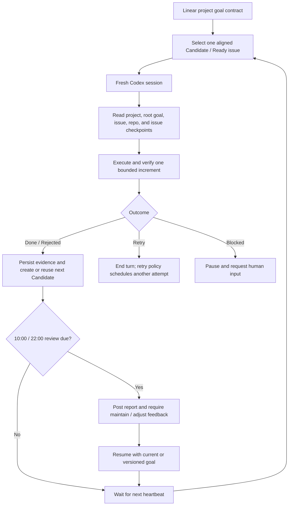

# Loophony

Loophony is a small, Linear-driven 24/7 agent orchestrator built on
[OpenAI Symphony](https://github.com/openai/symphony). You define one durable objective on a
Linear project, and Loophony repeatedly gives Codex one bounded Linear issue at a time. Linear is
the human-facing control plane; local SQLite, repository artifacts, and git history preserve the
execution trail between fresh Codex sessions.

> [!WARNING]
> Loophony is an experimental preview for trusted local environments. It never enables live
> trading, spending, or secret entry through prompts.

## Operating contract

- One Loophony loop equals one Linear issue and one fresh Codex execution session.
- A heartbeat checks for work every 20 minutes, but never starts another loop while one is running.
- The pending queue is bounded to five issues.
- Issues with verified evidence may move directly to `Done`; they do not accumulate in human
  review.
- Only a real `Blocked` condition and the scheduled 10:00/22:00 KST goal-review gate require human
  input.
- The project description holds the big objective, the `[Goal]` issue holds measurable success
  criteria, and `[Agent Goal Review]` holds human maintain/adjust decisions.

## Set up from Codex App

Codex can perform the installation for you. The only manual boundaries are connector OAuth, local
Keychain secret entry, and starting a new Codex task after new plugins are installed.

Prepare these non-secret values:

- an existing Linear project URL or unambiguous project name;
- your Linear reviewer handle;
- the git clone URL of the repository where Loophony should do its work.

Do not paste a Linear API token, brokerage secret, or other credential into Codex or Linear.

### 1. Bootstrap Loophony

Open a new task in Codex App and paste this prompt:

```text
Install Loophony on this Mac from the public repository
https://github.com/djm07073/loophony.

1. Install the repository's skills/loophony-setup skill in my Codex user skills directory.
2. Read the installed SKILL.md and continue following it in this task.
3. Safely clone the repository to ~/dev/agents/loophony, or reuse a clean matching clone.
4. Run preflight checks and install the Loophony, Linear, and Alpaca plugins.
5. If Linear or Alpaca OAuth is required, stop at the correct point and tell me how to connect it
   in Codex App.
6. Build and verify the Elixir daemon, but do not start the service yet.
7. Never request or print tokens or secrets in chat.

If a new Codex task is required to load the new plugins, give me the exact goal-creation prompt to
paste into that task.
```

Connect Linear in Codex App when prompted. Alpaca is optional unless the project needs its
read-only market-data tools. Start a new Codex task after the plugins are installed.

### 2. Create the durable project goal

In the new task, replace the placeholders and paste:

```text
$loophony-create-goal

Create the durable Loophony goal for this Linear project.

- Project: <LINEAR_PROJECT_URL_OR_EXACT_NAME>
- Desired change: <BROAD_OBJECTIVE>
- Important constraints: <CONSTRAINTS_OR_UNKNOWN>

Read the project and existing issues first. Research facts that you can verify independently.
Ask one question at a time only for decisions I must make, such as goals, scope, and tradeoffs.
Define the goal contract using observable outcomes, success criteria, evidence sources, non-goals,
authority boundaries, and conditions for achievement, rejection, or reframing—not activity volume.

Before writing, show me the draft and quality-gate result and obtain my approval.
After approval, create or update the project description's Loophony Goal block, the [Goal] root
issue, and the [Agent Goal Review] issue without creating duplicates.
Do not create an executable Candidate issue yet.
```

The skill returns the project slug, root goal issue, and persistent review issue identifier. Keep
those values for the final setup prompt.

### 3. Seed the first loop

Goal provisioning deliberately does not invent an execution backlog. After approving the goal,
paste this follow-up in the same task to create only the first bounded issue:

```text
Create the highest-leverage first executable issue for the Loophony goal we just approved.

Re-read the Linear project and [Goal] root issue, then select one unmet success criterion.
Create exactly one child issue with these requirements:

- State: Candidate
- Label: symphony-quant
- Explicitly map it to at least one SC-* success criterion
- Keep it independently verifiable within one Codex session
- Include acceptance checks and required evidence before execution
- Inherit the project's constraints, non-goals, and authority boundaries
- Do not duplicate completed or rejected work

If the goal is already fully proven or no safe next increment exists, do not create an issue;
explain why. After creation, show the issue identifier, URL, and mapped success criterion.
```

This is the only issue that normally needs manual seeding. Before a worker finishes, it creates or
reuses exactly one suitable next `Candidate` unless the root goal is fully proven or the current
issue is `Blocked`.

### 4. Configure and start the daemon

Open a new task, replace the placeholders with the values returned above, and paste:

```text
$loophony-setup

Continue configuring Loophony and start it as a 24/7 service.

- Linear project slug: <PROJECT_SLUG>
- Goal-review issue: <TEAM-123>
- Reviewer: <@HANDLE>
- Work repository clone URL: <GIT_CLONE_URL>

Render the configuration, build the daemon, and run its health check.
If a Linear API token is required, never accept it in chat. Give me only the command that lets me
enter it directly into Keychain from my local terminal. Warn me that existing Candidate or Ready
issues may run immediately. After I confirm that you should start, install the launchd service.
Finally, show the daemon status, next heartbeat, and current running, queued, Blocked, and review
gate states.
```

After health succeeds, use `$loophony-control` in Codex App to inspect or steer the daemon.

## Example: a quant research goal

Assume the Linear project is `Quant Research Lab` and the initial request is vague:

> Continuously research US equity signals and find profitable strategies.

That is an activity, not a finishable goal. `$loophony-create-goal` asks about the baseline,
decision the system must enable, universe, evidence standard, authority, and stopping conditions.
For example, the short shaping dialogue might be:

```text
Codex: What is the current baseline that should change?
User: Data and notebooks exist, but results cannot be reproduced by a fresh session.

Codex: What decision must the finished system make reliably?
User: It must accept or reject a signal hypothesis under predefined out-of-sample and cost gates.

Codex: What authority is explicitly outside the system?
User: No live orders or spending. Read-only and paper data only.
```

The resulting contract could look like this:

```markdown
Outcome: Build a reproducible US-equity research system that can accept or reject signal
hypotheses using predeclared out-of-sample, cost, liquidity, and capacity gates without live
trading.

SC-01 — A point-in-time dataset can be rebuilt from an immutable snapshot
        | deterministic hash and data-quality checks pass
        | dataset manifest and CI report

SC-02 — The backtest harness detects injected look-ahead and survivorship leakage
        | all adversarial leakage fixtures fail closed
        | test report and committed fixtures

SC-03 — Every evaluated hypothesis produces a reproducible accept or reject decision
        | walk-forward result includes fees, spread, slippage, turnover and capacity assumptions
        | versioned research package linked from Linear

Non-goals: live orders, guaranteed returns, unrestricted universe expansion.
Authority: read-only or paper data only; credentials never enter Linear or prompts.
Achieved: all three contracts have repeatable evidence and can be operated by a fresh session.
Reframe: required data is unavailable or the evidence gates cannot answer the intended decision.
```

Loophony then turns the contract into bounded work, one issue at a time:

1. Codex App seeds `QRL-101 — Build immutable point-in-time dataset manifest`, mapped to `SC-01`.
2. One Codex session executes only `QRL-101`, records checkpoints in SQLite, updates one Linear
   workpad, commits reproducible artifacts, creates or reuses `QRL-102 — Add adversarial leakage
   fixtures`, and moves `QRL-101` to `Done` when evidence passes.
3. Completion triggers an immediate poll. Because no loop is running, Loophony selects `QRL-102`
   without waiting for the next 20-minute timer.
4. A later fresh session evaluates a signal hypothesis for `SC-03`. A correctly reproduced
   negative result may finish that issue as `Rejected`; it is not treated as an agent failure.
5. At 10:00 or 22:00 KST, Loophony posts a consolidated report to `[Agent Goal Review]` and pauses.
   The user responds `maintain` with feedback, or `adjust` with a revised direction. An adjustment
   creates a new goal version and future issues are realigned to it.



## How a fresh session recovers context

A new loop does not depend on hidden chat memory. It reconstructs its context from:

- the Linear project description and root `[Goal]` success criteria;
- the current issue description, relations, acceptance checks, workpad, and human comments;
- repository files, git history, tests, datasets, and published artifacts;
- only the current issue's recent SQLite checkpoints.

Cross-issue knowledge must be handed off explicitly through the next issue and linked artifacts.
The agent re-checks every candidate issue against the active goal before running it; misaligned work
is narrowed or rejected instead of silently consuming another loop.

## Manual installation

To install only the standalone bootstrap skill:

```sh
python3 ~/.codex/skills/.system/skill-installer/scripts/install-skill-from-github.py \
  --repo djm07073/loophony \
  --path skills/loophony-setup
```

To install only the public plugin:

```sh
/Applications/Codex.app/Contents/Resources/codex plugin marketplace add djm07073/loophony
/Applications/Codex.app/Contents/Resources/codex plugin add loophony@loophony-public
```

## Upstream Symphony

The original Symphony design turns project work into isolated agent runs. This fork keeps the
official Elixir orchestrator as its base and adds the Linear goal contract, issue-scoped SQLite
loop memory, queue and heartbeat rules, scheduled human goal review, and the Loophony Codex plugin.

For the upstream specification and reference implementation, see:

- [Symphony specification](https://github.com/openai/symphony/blob/main/SPEC.md)
- [Elixir runtime documentation](elixir/README.md)
- [Loophony quant profile](quant/README.md)

## License

This project is licensed under the [Apache License 2.0](LICENSE).
